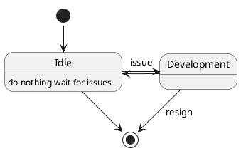

# Motivation and Scope
State Machines are fundamental aspect of computer sience and are wildy used in the industry.
There are many aspects to consider when implementing a state machine framwork, and a good standard library can ease the burden for developers.

# Terminology
State Machine means different things to different people.
This sectoin sets the terminology for the rest of the paper.

## FSM
FSM is a Finite State Machine. It encapsulates everything this proposal suggests.<br>
The facility this paper proposed is called fsm.
```cpp
std::fsm my_fsm;
```
A FSM has the following responsibilities:<br>
* Holds its states 
* Holds a common context for all states
* Transit between states.

## State
A State is a position in the state machine. The state machine itself can rest, at a given time, only in a single state.

## Transition
A Transition is the move of the state machine from one state to another.

## Context
The context of a state machine is the common data or functionality that is accesible to all states.


```cpp
    fsm::state wait_for_input("wait-for-input");
    fsm::state open("open");
    fsm::state locked("locked");	
	
	int retries = 3;
    
    fsm::transition(
		wait_for_input, // when in this state
		// do the following when the input is std::string
		[](const std::string password) -> std::fsm::state&
		{			
			if (fsm::context_v > 3) // quering the context
				{return locked;}
            if (password_ok(password)) // cheking the input
			   {return open;}
            ++fsm::context_v;	// changing the context
            return wait_for_input;
        }
    // construct an fsm with int as the common context
    std::fsm<int> myfsm(retries);
```

## Inputs
When the state machine is constructed and active, the inputs it handles are _events_ that the user _fires_ on it.
From the user's point of view the fsm is a "black box" in the sense that the user doesn't and should't know 
wich state is about to handle the fired event.

## Outputs
There are many ways a state machine can produce outputs.<br>
- The final state of the fsm. 
- Update of the context to be exmine externaly. 
- Calling external facilities with results.
- Other
There is no standard way to generate outputs.

# UML Standard
[@OMG] defines a set of facilities that define a state machine. <br>
When implementing a state machine
we should choose what facilities are in the standard implementation:

* MANDATORY: must have.
* OPTIONAL: may have.
* EXTENSION: may have either in future releases or by means of having users the ability to implement.
* OTIOSE: adding it will degragate from the quality of the implementation.



# Open Issues
* Completeness: should all states handle all inputs?
** Yes: it is safer, it covers all possible situations.
** No: it is just too much effort from the developer point of view to force declarig handling of impossible combinations of state/input.
* Explicit and enforced states transitions vs. implicit and non enforced state transition
ADD EXAMPLE 

# Sources
The code for the diagrams in this paper are witten in PlantUML and can be used to regenrate the drawing with uml-generator like https://www.planttext.com

---
references:
  - id: OMG
    citation-label: UML
    title: "State Machine Specification in OMG"
    author:
      - family: formal/2009-02-02
        given: Version 2.2
    URL: https://www.omg.org/spec/UML/2.2/Superstructure 

  - id: StateCharts
    citation-label: State Charts
    title: "A visual formalism for complex systems"
    author:
      - family: HAREL
        given: David 
    URL: https://www.wisdom.weizmann.ac.il/~dharel/SCANNED.PAPERS/Statecharts.pdf
---


# Acknowledgements
Michael Park <mcpark@gmail.com> (for github.com/mpark/wg21)

